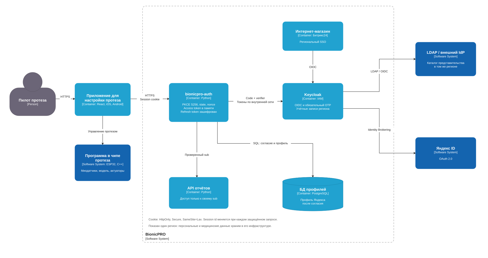
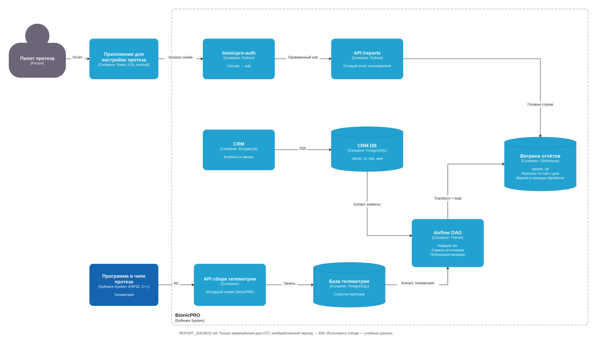
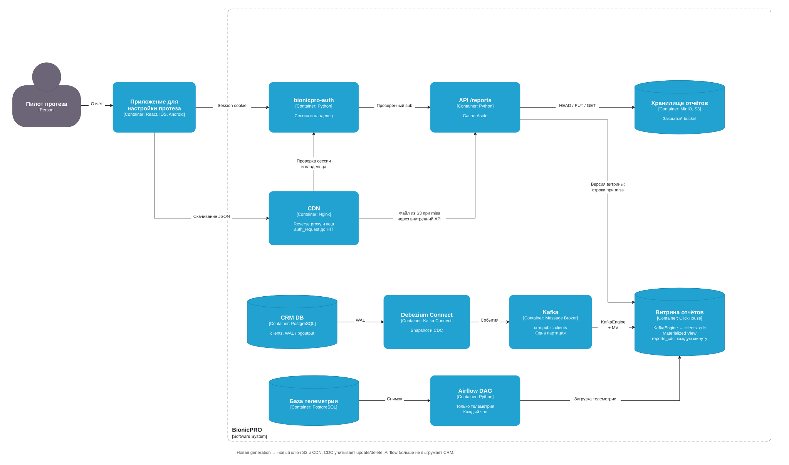

# BionicPRO

Схемы:

security
ETL
CDC

## Как работает

`bionicpro-auth` выполняет вход через Keycloak с PKCE и обязательным OTP. Access token живёт 120 секунд и хранится в памяти, refresh token — там же в зашифрованном виде. Браузер получает только `HttpOnly` / `Secure` cookie на 30 минут. При защищённом запросе меняем session id, токены обновляем через refresh. После перезапуска сервиса нужно войти заново.

Пользователей и роли представительства получаем из OpenLDAP. Для каждого региона предполагается свой IAM и локальное хранение персональных и медицинских данных; Compose показывает один регион. Настройки Keycloak — в [экспорте realm](keycloak/keycloak-results-export.json).

Airflow каждый час объединяет CRM и телеметрию в дневную витрину ClickHouse. `/reports` читает готовые строки только для `sub` из сессии; период ещё не обработан — возвращает `409`. В режиме `cdc` клиенты приходят через Debezium → Kafka → KafkaEngine, Airflow загружает только телеметрию. Materialized View раз в минуту обновляет витрину с учётом изменения и удаления клиентов.

Готовый JSON сохраняем в MinIO, повторный запрос получает ссылку на CDN без чтения строк отчёта из ClickHouse. Ключ: `reports/{source}/{generation}/{sub}/{start}_{end}.json`; новая версия витрины даёт новый путь. Nginx кеширует файл и проверяет владельца даже при HIT. Bucket закрыт.

## Запуск

```bash
bash scripts/start.sh
```

Скрипт собирает стенд, настраивает MinIO и CDC, запускает Airflow DAG. MinIO собираем из исходников закреплённого релиза: готовый образ в Quay возвращал `401`. Первая сборка занимает несколько минут. Приложение: https://localhost:8443, сертификат самоподписанный.

Пользователи `user1` и `user2`, пароль `password123`. При первом входе подключаем Google Authenticator или FreeOTP. Данные созданы за два дня перед первым запуском БД: выбираем один из них, поле «До» в период не входит. Даты по UTC; при повторном запуске набор остаётся прежним.

По умолчанию API читает CDC-витрину. Для задания 2 ставим `REPORT_SOURCE=etl` в `.env` и повторяем запуск. Для [Яндекс ID](#яндекс-id) нужны реквизиты приложения.

[Keycloak](https://localhost:8443/id/admin/) — `admin` / `admin`. [Airflow](http://localhost:8089) — `admin`, пароль получаем командой:

```bash
docker compose exec airflow cat /opt/airflow/standalone_admin_password.txt
```

## Яндекс ID

В [Яндекс OAuth](https://oauth.yandex.ru/client/new) создаём приложение с правами `login:info` и `login:email`. Redirect URI:

```text
https://localhost:8443/id/realms/reports-realm/broker/yandex/endpoint
```

До первого запуска задаём `YANDEX_CLIENT_ID` и `YANDEX_CLIENT_SECRET` в `.env`. Если realm уже создан, вводим их в Keycloak → Identity providers → Яндекс ID.

## Проверка

проверено 02.10.2026: `start.sh` завершился, все 14 сервисов работают. Прошли вход с OTP, LDAP, обновление токена, проверка доступа к чужому отчёту, кеш S3/CDN, ETL и создание, изменение и удаление клиента через CDC.

| что | скриншот |
| --- | --- |
| контейнеры | [Docker Desktop](screenshots/startup.png) |
| Airflow | [успешные запуски DAG](screenshots/airflow-dag.png) |
| ETL | [запрос к витрине в ClickHouse](screenshots/etl.png) |
| S3 | [JSON отчёта в приватном bucket MinIO](screenshots/minio.png) |
| CDC | [создание](screenshots/cdc-create.png), [изменение](screenshots/cdc-update.png), [удаление](screenshots/cdc-delete.png) |

снимки сделаны в интерфейсах Docker Desktop, Airflow, ClickHouse и MinIO. Для CDC использован временный клиент `99`: имя в отчёте меняется без новой телеметрии, после удаления поля отчёта становятся `NULL`. Тестовые данные после проверки удалены.

Снимок MinIO подтверждает сохранение JSON. Попадание в кеш S3/CDN проверено запросами к API, отдельного снимка пока нет. Вход через Яндекс ID не проверен: реквизиты приложения не заданы. Снимки входа и отчёта в приложении пока не добавлены: нужно вручную подтвердить самоподписанный сертификат в Chrome.
